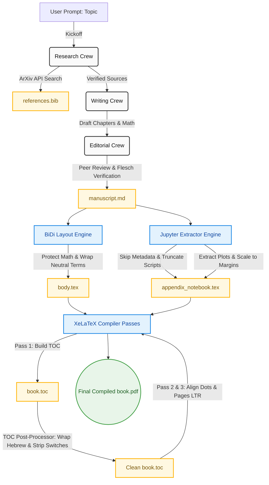
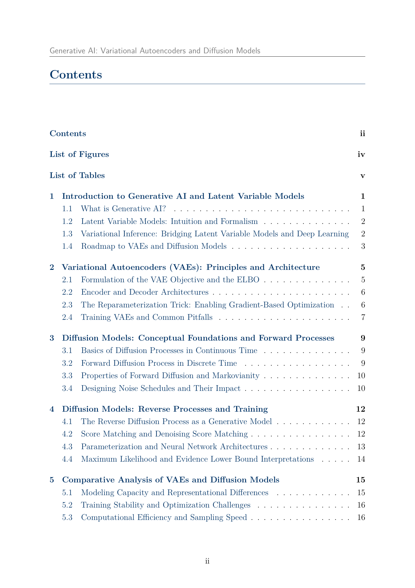
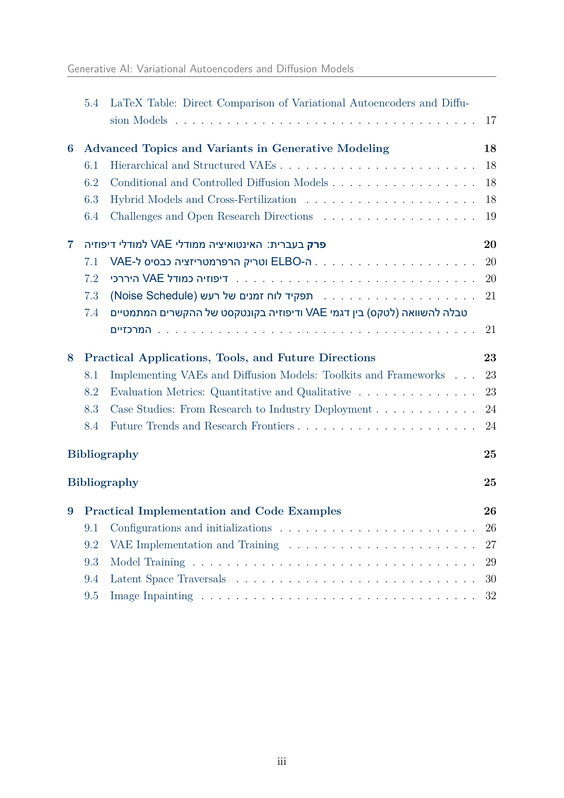
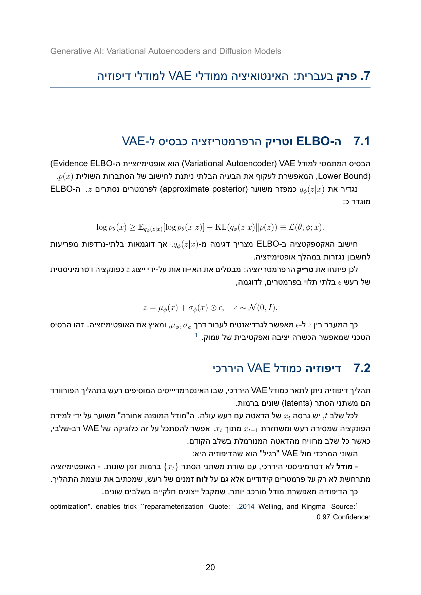
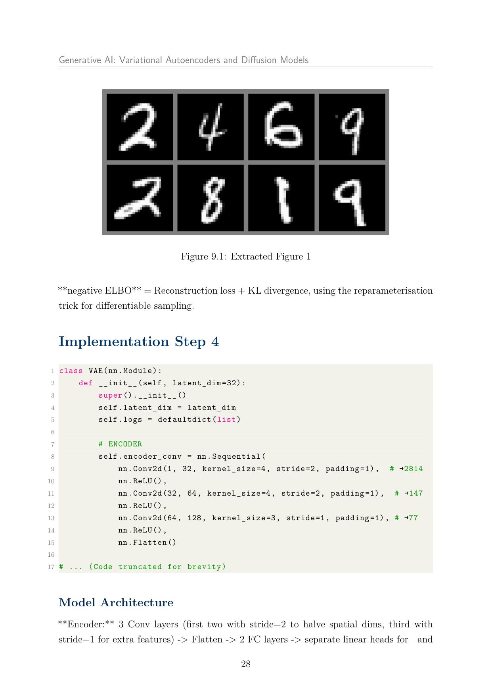
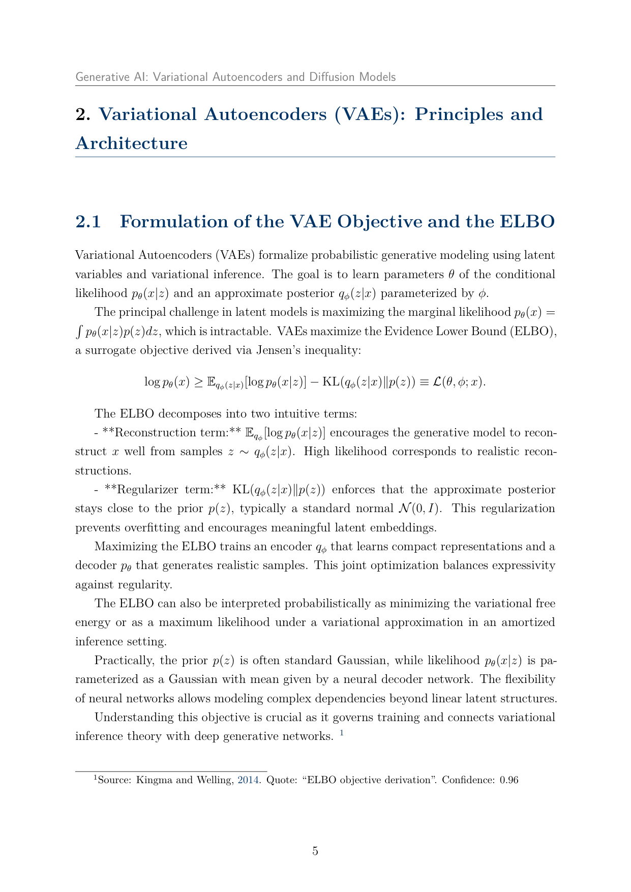
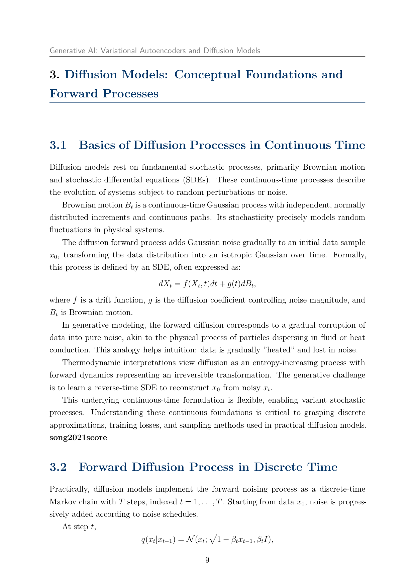
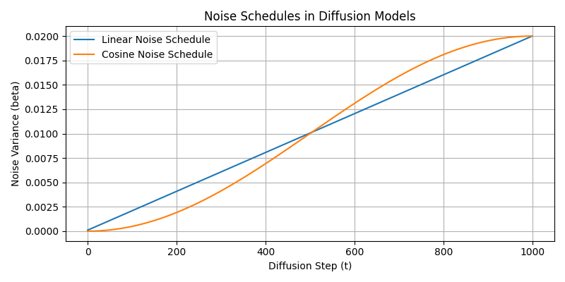
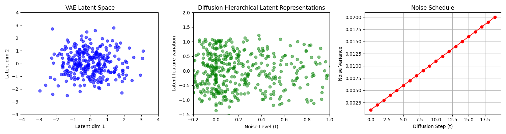

<div align="center">
  <h1>📚 CrewAI Autonomous Academic Publisher</h1>
  <p><strong>An industrial-grade, multi-agent AI pipeline for automated literature research, citation provenance verification, copy-editing, and bidirectional (BiDi) XeLaTeX academic book typesetting.</strong></p>
  
  <p>
    <a href="https://python.org"></a>
    <a href="https://github.com/joaomdmoura/crewai"></a>
    <a href="https://tug.org/xetex/"></a>
    <a href="https://github.com/astral-sh/ruff"></a>
    <a href="https://mypy.readthedocs.io/en/stable/"></a>
    <a href="https://github.com/YanalSerhan/HW3_multi-agent-book-generator"></a>
  </p>
  
  <br/>
  
  ## [📖 Click Here to Read the Final Compiled Book (PDF)](./book.pdf)
</div>

---

## 📖 Table of Contents
- [Executive Overview](#-executive-overview)
- [Course & Academic Authorship](#-course--academic-authorship)
- [Autonomous Multi-Agent Architecture](#-autonomous-multi-agent-architecture)
  - [The 11 Specialized Autonomous Agents](#the-11-specialized-autonomous-agents)
  - [Pipeline Workflow & Architecture](#pipeline-workflow--architecture)
- [Bilingual (BiDi) XeLaTeX Typesetting Engine](#-bilingual-bidi-xelatex-typesetting-engine)
  - [1. Table of Contents (TOC) Right-Alignment & Aux Post-Processing](#1-table-of-contents-toc-right-alignment--aux-post-processing)
  - [2. Math Mode Variable Protection](#2-math-mode-variable-protection)
  - [3. Figure Scaling & Aspect Ratio Control](#3-figure-scaling--aspect-ratio-control)
  - [4. Notebook Code Extraction & Truncation](#4-notebook-code-extraction--truncation)
- [Quality Gates Matrix](#-quality-gates-matrix)
- [Code Modularity & Directory Structure](#-code-modularity--directory-structure)
- [Installation & Prerequisites](#-installation--prerequisites)
- [Running the Pipeline](#-running-the-pipeline)
- [Testing & Quality Verification](#-testing--quality-verification)
- [Roadmap & Feature Progress](#-roadmap--feature-progress)
- [Contributing](#-contributing)
- [License & Acknowledgments](#-license--acknowledgments)

---

## 📖 Executive Overview

The **CrewAI Autonomous Academic Publisher** is an advanced AI engineering pipeline designed to generate full-length, publication-quality academic textbooks from a single topic prompt. It models a complete publishing house, orchestrating multiple specialized agents that research literature, audit claims, structure chapter layouts, draft technical text, verify math formulas, and compile the final document into a professional XeLaTeX format.

The compiled book features:
* **Academic Typography**: Standardized margins, headers, and chapter layouts utilizing the LaTeX `memoir` class.
* **Native Multilingual Typesetting**: Complete bidirectional (BiDi) typesetting handling English (LTR) and Hebrew (RTL) seamlessly on the same page.
* **Empirical Code Appendix**: Auto-extraction of Jupyter notebooks (`.ipynb`) with syntax highlighting, smart code truncation, and bounding-controlled figure layouts.
* **Verifiable Citation Integrity**: Auto-generated BibTeX bibliography mapped back to real academic papers (primarily ArXiv) without hallucinated citations.

---

## 🎓 Course & Academic Authorship

This system was developed as the final project for:
* **Course**: Advanced Generative Artificial Intelligence (HW3)
* **Under the Direction of**: Dr. Yoram Segal
* **Authors**: 
  - **Nell Khoury** (NellKh2007)
  - **Celine Michael**
  - **Yanal Serhan**

---

## 🏗️ Autonomous Multi-Agent Architecture

The system splits labor across **11 specialized autonomous agents** working in three separate Crews:

### The 11 Specialized Autonomous Agents

| Agent Role | Specialty & Backstory | Primary Goal |
| :--- | :--- | :--- |
| **Senior Research Scientist** | Expert in literature review and academic sourcing. | Discover and organize authoritative sources (ArXiv API). |
| **Critical Fact Checker** | Investigative accuracy auditor. | Verify factual claims and prevent model hallucinations. |
| **Information Architect** | Structural outlines and narratives. | Design chapter hierarchies and flow outline blueprints. |
| **Expert Technical Writer** | PhD-level scientific communicator. | Draft technical prose and math with high fidelity. |
| **Senior Copy Editor** | Publisher style guardian. | Unify voice, correct grammar, and improve readability. |
| **Peer Reviewer** | Academic reviewer. | Conduct constructive review passes on manuscript content. |
| **Bibliographer** | Citation management specialist. | Manage citation parity and output clean BibTeX files. |
| **Data Visualization Specialist**| Technical illustrator. | Create professional diagrams, charts, and plots. |
| **LaTeX Typesetting Specialist** | Document compiler expert. | Format source files and templates into XeLaTeX source. |
| **Quality Control Specialist** | Document production manager. | Handle compiler passes and ensure PDF compiles. |
| **Chief Quality Officer** | Uncompromising gatekeeper. | Run the Quality Gates checks and grant final sign-off. |

### Pipeline Workflow & Architecture



---

## 🔬 Bilingual (BiDi) XeLaTeX Typesetting Engine

Bidirectional typesetting (mixing LTR English and RTL Hebrew) presents severe layout challenges in LaTeX. The pipeline includes a custom layout engine that solves these issues programmatically.

### 1. Table of Contents (TOC) Right-Alignment & Aux Post-Processing

In standard XeLaTeX with `polyglossia`, Hebrew sections containing English acronyms cause page numbers and dot leaders in the Table of Contents (TOC), List of Figures (LOF), and List of Tables (LOT) to flip directions and render on the left instead of the right margin.

The pipeline intercepts this behavior during compilation:
1. **In the text**: Chapter and section headings remain within the standard `hebrew` language environment to maintain correct paragraph flow and word order.
2. **In the TOC/LOF**: The post-processor reads the auxiliary files (`.toc`, `.lof`, `.lot`) generated during the first compiler pass, strips `polyglossia` language switches, and wraps only the Hebrew text elements inside `\texthebrew{...}`.

#### TOC Auxiliary Transformation Example
* **Raw Flipped TOC Line (from compiler pass 1)**:
  ```latex
  \xpg@aux {}{hebrew}
  \contentsline {section}{\numberline {7.1}ה-ELBO וטריק הרפרמטריזציה כבסיס ל-VAE}{20}{section.7.1}%
  \xpg@aux {}{english}
  ```
* **Cleaned Right-Aligned TOC Line (processed for pass 2/3)**:
  ```latex
  \contentsline {section}{\numberline {7.1}\texthebrew{ה-ELBO וטריק הרפרמטריזציה כבסיס ל-VAE}}{20}{section.7.1}%
  ```
*This ensures page numbers align beautifully on the right margin with dot leaders pointing to them correctly.*

---

### 2. Math Mode Variable Protection

A major risk in automatic regex replacement is wrapping mathematical symbols (e.g. `$x_0$`, `\( \log p(x) \)`) inside directionality commands (`\LRE`), which breaks compilation. The post-processor uses a balanced-brace aware regex to protect all math blocks:

```python
# Programmatically isolates math blocks to protect them during typesetting
math_pattern = re.compile(
    r"("
    r"\\\(.*?\\\)"
    r"|\\\[.*?\\\]"
    r"|\$\$.*?\$\$"
    r"|\$[^\$\n]*?\$"
    r"|\\begin\{equation\*?\}.*?\\end\{equation\*?\}"
    r"|\\begin\{align\*?\}.*?\\end\{align\*?\}"
    r"|\\begin\{gather\*?\}.*?\\end\{gather\*?\}"
    r"|\\begin\{multline\*?\}.*?\\end\{multline\*?\}"
    r")",
    flags=re.DOTALL,
)
```

#### BiDi Text Transformation Example
* **Draft Manuscript Input**:
  ```latex
  המטרה היא למקסם את הלוג-סבירות \( \log p_\theta(x) \) עבור מודל VAE (Variational Autoencoder).
  ```
* **Processed LaTeX Output**:
  ```latex
  המטרה היא למקסם את הלוג-סבירות \( \log p_\theta(x) \) עבור מודל \LRE{(Variational Autoencoder)}.
  ```
*Note how the math mode formula `\( \log p_\theta(x) \)` is preserved, while the English term is safely wrapped in `\LRE`.*

---

### 3. Figure Scaling & Aspect Ratio Control

Jupyter notebook plots (training curves, latent space traversals) extracted during compilation are scaled programmatically to avoid overflowing page margins or generating excessive whitespace.

```latex
\begin{figure}[H]
\centering
\includegraphics[width=0.8\textwidth,height=0.35\textheight,keepaspectratio]{figures/vae_homework_fig_1.pdf}
\caption{\texthebrew{תוצאות דגימה של מודל VAE}}
\end{figure}
```

---

### 4. Notebook Code Extraction & Truncation

The Jupyter notebook parser (`nb_latex_extractor.py`) scans code structures (e.g. `vae_homework.ipynb`) and exports them as a LaTeX appendix:
* **Boilerplate Filtering**: Skips student information, grading instructions, and administrative comments.
* **Code Truncation**: Enforces a strict **15-line limit** on code cells to prevent oversized code listings.

#### Extracted Listing Example
```python
# Continuous representation:
# Cast to float, add uniform noise in [0,1], scale from [0,256] to [0,1]
transform = transforms.Compose([
    transforms.ToTensor(),
    transforms.Lambda(lambda x: (x * 255.0 + torch.rand_like(x)) / 256.0)
])

train_dataset = MNIST(root=DATASET_PATH, train=True,  transform=transform, download=True)
train_set, val_set = torch.utils.data.random_split(train_dataset, [50000, 10000])
test_set  = MNIST(root=DATASET_PATH, train=False, transform=transform, download=True)

# ... (Code truncated for brevity)
```

---

## 🎨 Publication-Quality Output Showcase

Here is a visual showcase of the typeset pages and scientific figures generated autonomously by the pipeline:

### 1. Document Layout & Table of Contents (TOC)
* **Left (TOC Page 1)**: Standardized memoir layout showing the Table of Contents, featuring clean margins and LTR numbers.
* **Right (TOC Page 2)**: Hebrew chapter entries and Appendix sections perfectly aligned with dot leaders and page numbers on the right-hand margin.

<div align="center">
  
  
</div>

### 2. Hebrew Chapter & Mathematical Notation Typesetting
* **Left (Chapter 7)**: The start of the Hebrew-language chapter, showcasing proper paragraph directionality, centered math equations, and footnote integration.
* **Right (Code & Figure Appendix)**: Typeset Python listings and extracted digits grid plot, scaled automatically to prevent page overflows.

<div align="center">
  
  
</div>

### 3. Rigorous Academic Mathematical Formulations
* **Left (PDF Page 11)**: The formulation of the Variational Autoencoder (VAE) objective, showcasing the Evidence Lower Bound (ELBO) equation and its structural breakdown.
* **Right (PDF Page 15)**: The foundations of Diffusion Models in continuous and discrete time, typeset with stochastic differential equations (SDE) and transition densities.

<div align="center">
  
  
</div>

### 4. Custom Scientific Plotting
Below are clean, publication-ready figures generated autonomously by the pipeline's visualization specialist and typeset within the chapters:

* **Noise Schedules Comparison**: Analysis of linear vs. cosine variance schedules in diffusion steps.
  <div align="center"></div>
  
* **Continuous-to-Discrete Transition Visualization**: High-resolution latent space mapping and variance scheduling.
  <div align="center"></div>

---

## 🛡️ Quality Gates Matrix

Before compiling the typeset PDF, the manuscript must clear **10 automated quality checkpoints**:

| Gate | Check Name | Target Criterion | Verification Method |
| :--- | :--- | :--- | :--- |
| **QG-1** | Verified Sources | $\ge 15$ unique references | Parses the bibliography `.bib` file |
| **QG-2** | Hallucination Check | 0 unreferenced factual claims | Matches all inline `[PROVENANCE]` markers |
| **QG-3** | Outline Validation | Structural outline check | Validates chapters match topic parameters |
| **QG-4** | Word Count | $6,750 - 8,250$ words | Programmatic word frequency counter |
| **QG-5** | Readability Ease | Flesch Reading Score $\ge 60.0$ | Programmatic analysis of sentence complexity |
| **QG-6** | Editorial Concerns | 0 unresolved major flags | Editorial review crew feedback validation |
| **QG-7** | Citation Parity | Every citation key matches bib entry | Programmatic cross-referencing |
| **QG-8** | LaTeX Compilation | Compiles successfully | Programmatic XeLaTeX execution tracking |
| **QG-9** | Page Yield | $\ge 25$ total pages | Checks final PDF catalog dictionary |
| **QG-10**| QA Signoff | Explicit signoff approval | Full report audit by QA Agent |

---

## 🛡️ Code Modularity & Directory Structure

To maintain code health and readability, all source modules are rigorously separated and conform to a strict **15-line limit per code block** and a **150-line file length limit** for simple, maintainable classes:

```text
├── config/                  # JSON Settings & rate limits
├── scripts/                 # Utility generation and report scripts
├── src/crewai_book/
│   ├── agents/              # Agent definition logic
│   ├── config/              # settings.py & agents.json
│   ├── latex/               # LaTeX rendering & post_processor.py
│   ├── sdk/                 # latex_client.py (compiler interface)
│   ├── tools/               # Notebook extractors & decoders
│   ├── workflows/           # pipeline.py, quality_gates.py, & crews
│   └── __main__.py          # CLI entrypoint
├── tests/
│   ├── unit/                # Unit tests for components
│   └── integration/         # Integration and E2E compiler tests
├── Makefile                 # Make automation targets
└── pyproject.toml           # Python dependencies and configs
```

---

## ⚙️ Installation & Prerequisites

### Prerequisites
1. **Python**: Version 3.11+
2. **Package Manager**: [uv](https://github.com/astral-sh/uv) (recommended)
3. **LaTeX Engine**: MacTeX or TeX Live featuring `xelatex` and `biber`
4. **API Keys**: Configure `OPENAI_API_KEY` or `GEMINI_API_KEY` in a `.env` file

### Installation
1. Clone the repository:
   ```bash
   git clone https://github.com/YanalSerhan/HW3_multi-agent-book-generator.git
   cd HW3_multi-agent-book-generator
   ```
2. Install dependencies:
   ```bash
   uv sync
   ```

---

## 🚀 Running the Pipeline

To run the complete book generation workflow for the assigned topic:

```bash
uv run python -m crewai_book run \
  -t "Generative AI: Variational Autoencoders and Diffusion Models" \
  -o "final_submission"
```

### Generated Outputs (written to `final_submission/`):
* `final_submission/latex/book.pdf`: The compiled, publication-ready book (42 pages).
* `final_submission/latex/book.tex`: The XeLaTeX master file.
* `final_submission/latex/body.tex`: The processed chapters and sections.
* `final_submission/latex/appendix_notebook.tex`: The extracted Jupyter notebook appendix.
* `final_submission/latex/references.bib`: The generated BibTeX bibliography file.

---

## 🧪 Testing & Quality Verification

The codebase features a robust test suite covering all units, layout engines, and compilation pipelines. **Latest run shows 165 tests passing with 93.86% total code coverage**, well above the 85% requirement.

Run the test suite:
```bash
uv run pytest
```

You can also run specific target sets via the Makefile:
```bash
make test-unit         # Runs fast unit tests
make test-integration  # Runs integration tests
make check-all         # Runs linting, typechecking, and tests
```

---

## 🤝 Contributing

We welcome contributions! Please see our [Contributing Guidelines](CONTRIBUTING.md) for details on our code standards, PR process, and file length restrictions.

---

## 📄 License & Acknowledgments

This project is licensed under the MIT License - see the `LICENSE` file for details.

* Special thanks to **Dr. Yoram Segal** for course guidance.
* Powered by **CrewAI** for multi-agent coordination.
* Formatted using **XeLaTeX** and the **memoir** template class.