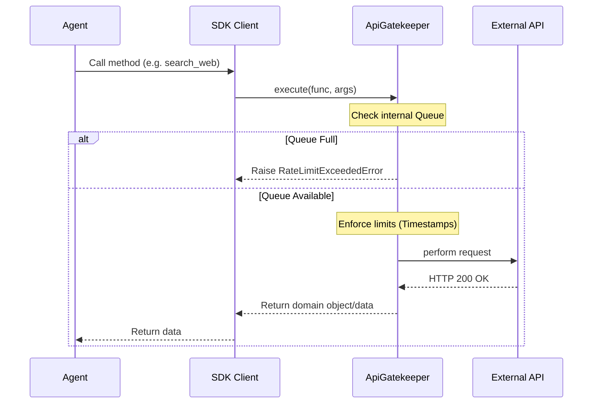
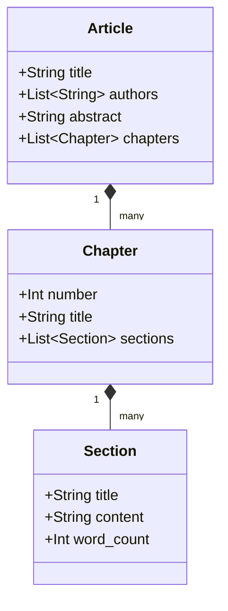

# Architecture of CrewAI Multi-Agent Book Generator

This document outlines the software architecture of the system, constructed following Domain-Driven Design (DDD) principles and strict layered separation.

## 1. System Context Diagram


## 2. Container Diagram (Layered Architecture)

The system enforces strict unidirectional dependencies from top to bottom.

```mermaid
graph TD
    subgraph "Application Core"
        Agents[CrewAI Agents & Workflows]
        Services[Service Layer\n(Business Logic)]
        SDK[SDK Layer\n(External Wrappers)]
        Domain[Domain Models\n(Entities & State)]
    end
    
    subgraph "Cross-Cutting"
        Gatekeeper[API Gatekeeper\n(Rate Limiting)]
        Observability[Observability\n(Loguru)]
        Config[Config & Settings]
    end

    Agents --> Services
    Services --> SDK
    SDK --> Gatekeeper
    Services --> Domain
    SDK --> Domain
```

## 3. API Gatekeeper Flow

As mandated by the guidelines, all external API traffic must pass through the ApiGatekeeper.



## 4. Domain Models

All state passes through Pydantic V2 models with strict validation.



## 5. Agent Design Rationale (AGENT-EVAL-01)

After the initial 10-agent design, we performed a structured evaluation per the criteria in §4.3:

| Evaluation Question | Decision | Rationale |
|---|---|---|
| Gap in research pipeline? | **No** — `Literature Review Agent` not needed | The Research Agent (A-01) handles both source discovery and initial synthesis. Adding a separate literature review agent would create redundant overlap without clear value. |
| Glossary management too burdensome for editor? | **No** — `Glossary Agent` not needed | Glossary management is a minor subtask (~10% of editor workload). It does not meet the >40% threshold for independent extraction. |
| Are figures/diagrams required? | **Yes** — `Figure Generation Agent` added | Figures are essential for a technical book. Code-execution-based figure generation is a distinct competency not shared by any other agent. Added as Agent A-11. |
| Is the LaTeX template complex enough to warrant split roles? | **No** — `Template Specialist Agent` not needed | The LaTeX Formatter Agent (A-08) handles both template application and content conversion. Template complexity is manageable within a single agent. |
| Any task >40% of an agent's workload? | **Figure generation for Writer** | Writer Agent (A-04) was originally expected to handle both prose and figures. Figure generation was extracted into its own agent (A-11) since it requires fundamentally different tools (code execution vs. LLM writing). |

### Final Agent Roster

| ID | Agent | Sub-Crew | Process |
|---|---|---|---|
| A-01 | Research Agent | Research | Hierarchical |
| A-02 | Fact Verification Agent | Research | Hierarchical |
| A-03 | Outline Architect Agent | Main | Sequential |
| A-04 | Writer Agent | Main | Sequential |
| A-05 | Editor Agent | Editorial | Hierarchical |
| A-06 | Reviewer Agent | Editorial | Hierarchical |
| A-07 | Citation Agent | Research | Hierarchical |
| A-08 | LaTeX Formatter Agent | Main | Sequential |
| A-09 | PDF Production Agent | Main | Sequential |
| A-10 | Quality Assurance Agent | Main | Sequential |
| A-11 | Figure Generation Agent | Main | Sequential |

