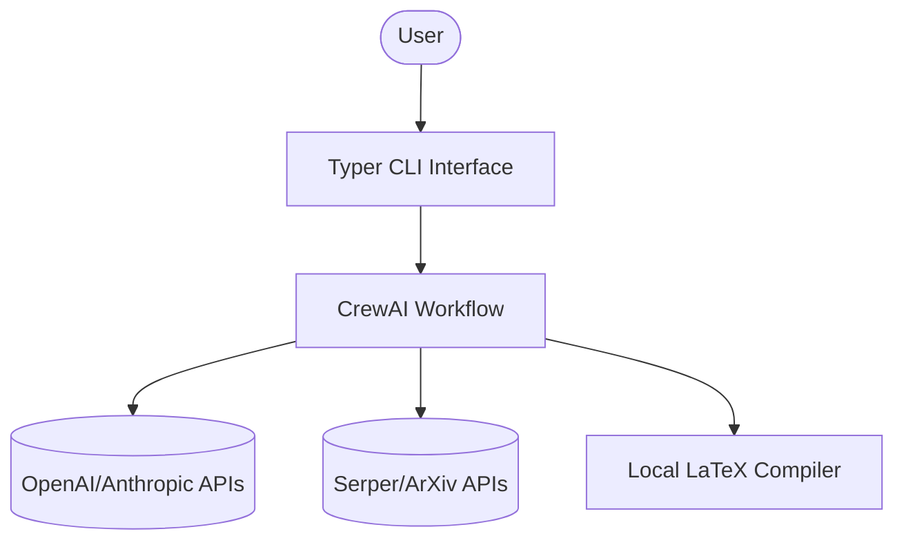
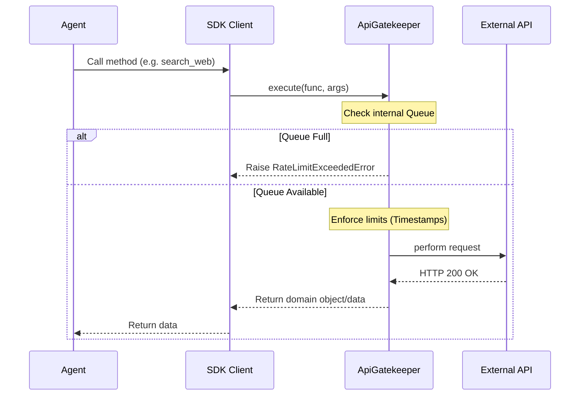
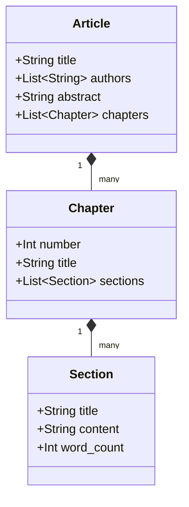

# Architecture of CrewAI Multi-Agent Book Generator

This document outlines the software architecture of the system, constructed following Domain-Driven Design (DDD) principles and strict layered separation.

## 1. System Context Diagram



## 2. Container Diagram (Layered Architecture)

The system enforces strict unidirectional dependencies from top to bottom.

```mermaid
graph TD
    subgraph "Application Core"
        Agents[CrewAI Agents & Workflows]
        Services[Service Layer\n(Business Logic)]
        SDK[SDK Layer\n(External Wrappers)]
        Domain[Domain Models\n(Entities & State)]
    end
    
    subgraph "Cross-Cutting"
        Gatekeeper[API Gatekeeper\n(Rate Limiting)]
        Observability[Observability\n(Loguru)]
        Config[Config & Settings]
    end

    Agents --> Services
    Services --> SDK
    SDK --> Gatekeeper
    Services --> Domain
    SDK --> Domain
```

## 3. API Gatekeeper Flow

As mandated by the guidelines, all external API traffic must pass through the ApiGatekeeper.



## 4. Domain Models

All state passes through Pydantic V2 models with strict validation.


